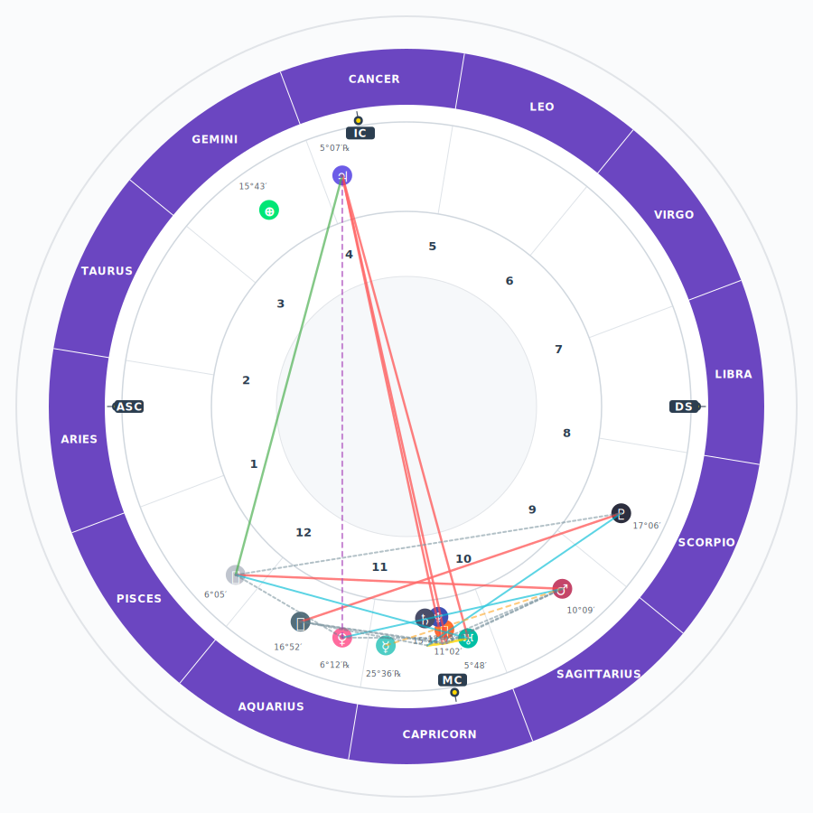
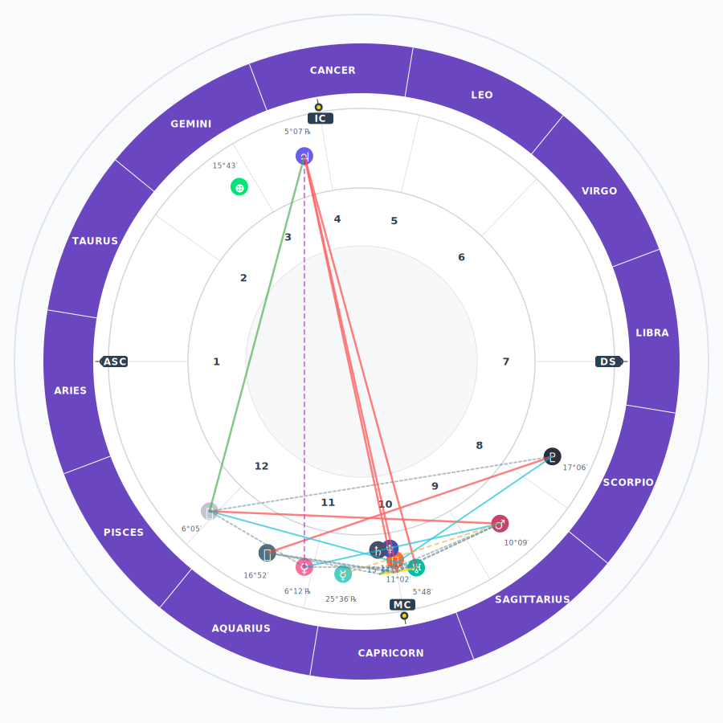
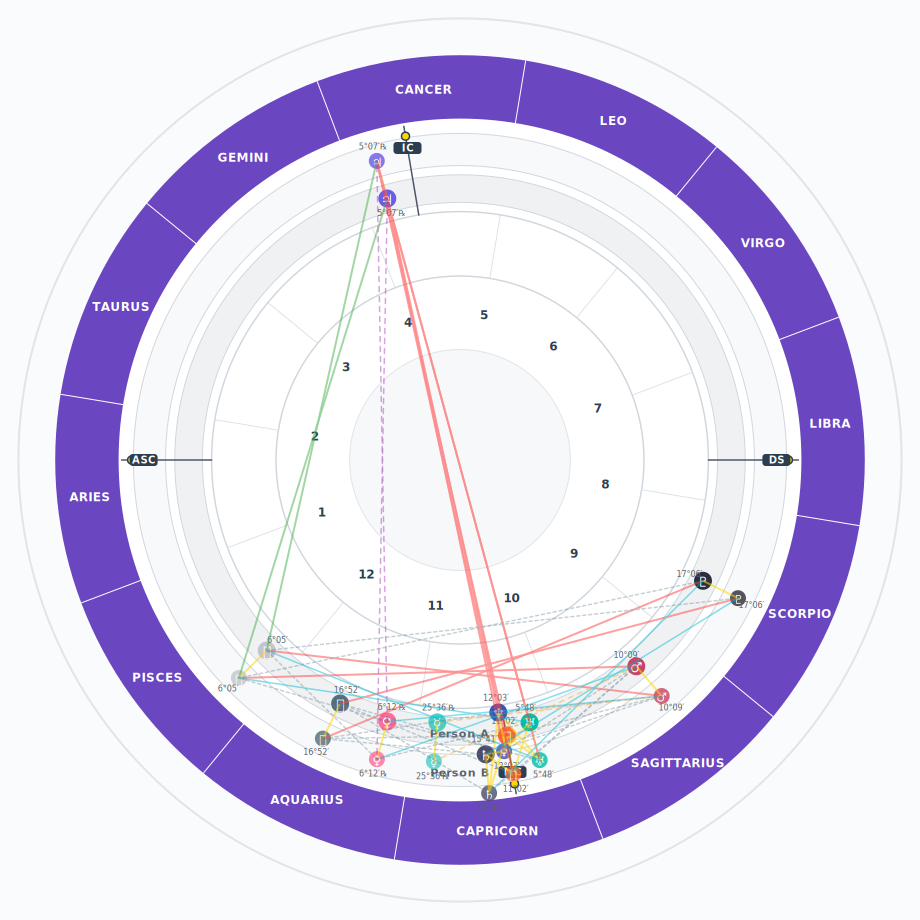

# Starluck Epoch API

> *FastAPI service for astrological charts & visuals — created by the Starluck team*

A powerful, modern API that computes natal data, renders beautiful SVG chart wheels, performs synastry calculations, and generates insightful astrological reports.

## Chart Examples

| **Whole Sign Chart** | **Placidus Chart** | **Synastry Biwheel** |
|:---:|:---:|:---:|
|  |  |  |

## Features

- **Natal Charts** — Complete birth chart calculations with planets, houses, angles & aspects
- **SVG Chart Wheels** — Beautiful single and biwheel visualizations  
- **Synastry & Composite** — Relationship compatibility analysis
- **Transit Forecasts** — Future planetary influences and timing
- **Markdown Reports** — Clean, readable astrological interpretations
- **High Performance** — Built with FastAPI for speed and reliability

## Quick Setup

### Prerequisites
- Python 3.11+

### Installation

```bash
# Clone the repository
git clone git@github.com:BerkePalamutcu/starluck-epoch.git
cd starluck-epoch

# Create and activate virtual environment
python -m venv .venv
source .venv/bin/activate   # Windows: .venv\Scripts\activate

# Install dependencies
pip install -r requirements.txt
```

### Configuration

Create a `.env` file in the root directory like:

```env
STARLUCK_DEBUG=false                 # If set true This will create a debug_outputs folder when you make requests so that you can examine the outputs. Set false in production or modify the code.
STARLUCK_API_KEY=                    # Optional API key protection in case you want to connect other services
STARLUCK_ALLOWED_HOSTS=127.0.0.1,localhost # Optional if you want to use it as a microservice feel free to modify
STARLUCK_CORS_ORIGINS=http://localhost:8000 # Optional if you want to use it as a microservice feel free to modify 
STARLUCK_SWE_PATH=                   # Optional; works without external files but if you want to use you can also include swiss ephimeris.
```

### Start the Server

```bash
uvicorn main:app --reload
```

**Health Check:** `GET /api/v1/health`

---

## API Reference

All endpoints are available under `/api/v1`. Include `Authorization: Bearer <key>` header if using API key authentication.

### Natal Chart
`POST /api/v1/natal`

Calculate a complete birth chart with planets, houses, and aspects.

<details>
<summary><strong>Request & Response Details</strong></summary>

**Request:**
```json
{
  "datetime_local": "1990-01-01 12:00",
  "timezone": "America/New_York",
  "location": {
    "lat": 40.7128,
    "lon": -74.0060,
    "elevation_m": 10
  },
  "house_system": "PLACIDUS"  // Options: "PLACIDUS", "WHOLE"
}
```

**Response:**
```json
{
  "angles": {
    "ASC": 23.4,
    "MC": 15.1,
    "DS": 203.4,
    "IC": 195.1
  },
  "houses": [23.4, 45.1, 67.8, ...],
  "planets": {
    "Sun": {
      "lon": 280.1,
      "deg": 10.1,
      "retro": false
    },
    "Moon": { ... }
  },
  "aspects": [
    {
      "p1": "Sun",
      "p2": "Moon",
      "aspect": "trine",
      "orb": 2.1
    }
  ]
}
```
</details>

---

### SVG Chart Wheel
`POST /api/v1/svg`

Generate a beautiful single-wheel SVG chart visualization.

<details>
<summary><strong>Request & Response Details</strong></summary>

**Request:**
```json
{
  "chart_data": { /* natal chart output */ },
  "size": 900,
  "show_aspects": true
}
```

**Response:**
```json
{
  "svg_content": "<svg width='900' height='900'>...</svg>",
  "size": 900
}
```
</details>

---

### Synastry Biwheel
`POST /api/v1/biwheel`

Create a synastry comparison chart with inner and outer wheels.

<details>
<summary><strong>Request & Response Details</strong></summary>

**Request:**
```json
{
  "inner_chart": { /* natal chart A */ },
  "outer_chart": { /* natal chart B */ },
  "size": 920,
  "label_inner": "Person A",
  "label_outer": "Person B",
  "show_aspects": true
}
```

**Response:**
```json
{
  "svg_content": "<svg width='920' height='920'>...</svg>",
  "size": 920
}
```
</details>

---

### Synastry Analysis
`POST /api/v1/synastry`

Calculate inter-chart aspects between two people (no SVG output).

<details>
<summary><strong>Request & Response Details</strong></summary>

**Request:**
```json
{
  "chart_a": { /* natal chart A */ },
  "chart_b": { /* natal chart B */ }
}
```

**Response:**
```json
{
  "interaspects": [
    {
      "p1": "Sun",
      "p2": "Moon",
      "aspect": "trine",
      "orb": 1.9
    }
  ]
}
```
</details>

---

### Composite Chart
`POST /api/v1/composite`

Generate a midpoint composite chart for relationship analysis.

<details>
<summary><strong>Request & Response Details</strong></summary>

**Request:**
```json
{
  "chart_a": { /* natal chart A */ },
  "chart_b": { /* natal chart B */ }
}
```

**Response:**
```json
{
  "midpoints": {
    "Sun": { "lon": 123.4 },
    "Moon": { "lon": 67.8 }
  }
}
```
</details>

---

### Chart Report
`POST /api/v1/report`

Generate a readable Markdown interpretation of a natal chart.

<details>
<summary><strong>Request & Response Details</strong></summary>

**Request:**
```json
{
  "chart_data": { /* natal chart output */ },
  "title": "Birth Chart Analysis"
}
```

**Response:**
```json
{
  "report_content": "# Birth Chart Analysis\n\n## Sun in Capricorn\n..."
}
```
</details>

---

### Transit Forecast
`POST /api/v1/forecast`

Calculate upcoming transit aspects to natal planets within a time window.

<details>
<summary><strong>Request & Response Details</strong></summary>

**Request:**
```json
{
  "natal_chart": { /* natal chart data */ },
  "start_date": "2025-09-18",
  "timezone": "America/New_York",
  "days": 7,
  "step_hours": 12
}
```

**Response:**
```json
{
  "transits": [
    {
      "when_utc": "2025-09-18T06:40:00Z",
      "transit": "Sun",
      "natal": "Mercury",
      "aspect": "trine",
      "orb_diff": 0.01
    }
  ]
}
```
</details>

---

## Technical Notes

- **Zero Dependencies**: Works out of the box without external Swiss Ephemeris files
- **Optional Enhancement**: Set `STARLUCK_SWE_PATH` to use external ephemeris data when available
- **High Accuracy**: Precise astronomical calculations for professional use
- **Modern Stack**: Built with FastAPI, offering automatic API documentation at `/docs`

## License

This project is licensed under the **AGPL License**. Free to use with some dependencies also under AGPL licensing.

## Contributing

We welcome contributions! Here's how to get involved:

**Bug Reports**: Open an issue with a clear description and minimal reproduction steps

**Feature Requests**: Suggest enhancements with detailed use cases  

**Design Improvements**: Submit PRs for UI/UX improvements with screenshots

**Documentation**: Help improve our docs and examples

Before submitting, please include a clear description, relevant screenshots for visual changes, and test your changes thoroughly.

---

© Starluck Team
